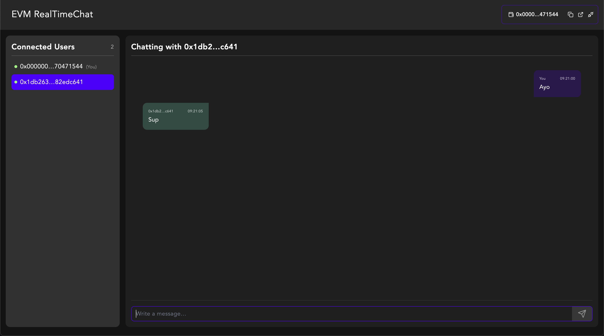
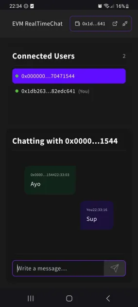

# EVM Real Time Chat Client

<a name="readme-top"></a>

[![Contributors][contributors-shield]][contributors-url]
[![Forks][forks-shield]][forks-url]
[![Stargazers][stars-shield]][stars-url]
[![Issues][issues-shield]][issues-url]
[![Unlicense][license-shield]][license-url]

| Desktop | Mobile |
|--------|--------|
|  |  |

This project exists to solve a specific problem: enabling direct, real-time chat between two connected EVM wallets.

I had no prior experience building live chat systems over WebSockets. My initial idea was to delegate the problem to Discord by creating private rooms between users, but that approach breaks down quickly due to server room limits and the mismatch between Discord’s identity model and wallet-based identity.

I then looked for existing projects that combined:

* wallet-address identity
* direct messaging
* Svelte (specifically Svelte 5) in-app WebSocket handling

I couldn’t find anything that cleanly fit those constraints. Rather than bolting something into my application, I decided to spend time understanding the underlying mechanics. These repositories are the result of that exploration.

This is an MVP. It intentionally makes several concessions in order to stay small, understandable and flexible.

## Scope and Limitations

This implementation is deliberately minimal:

* No message persistence

Messages exist only in memory. Reloading the page clears the local messageStore.
Persisting messages (for example, in a SQL-style schema) is an obvious next step.

* No EVM address verification

The server trusts the address provided during socket connection. This is acceptable while messages are ephemeral, but not safe for persisted messages.
A production system should validate ownership via message signing to prevent address spoofing and message leakage.

* No group or public chats

All chats are strictly one-to-one. Multi-participant or public rooms were not required for this use case, but could be added without major architectural changes.

* No WebSocket authentication or authorization
  
The WebSocket connection is not currently secured. There is no JWT, session cookie, or cryptographic verification step during connection or message sending. Any client that knows the server endpoint can establish a connection and emit events. This is acceptable for an MVP with no persisted data, but would need to be addressed before production use.

## Summary

The server exposes a WebSocket server (WSS) that remains active, waiting for incoming connections and messages.

When the client creates a WebSocket connection to the server URL, it performs an HTTP GET request which the server upgrades with a 101 Switching Protocols response. From that point onward, the client and server communicate over a full-duplex WebSocket connection.

Once connected, the client and server exchange a small, well-defined set of events to handle:

* presence tracking (online / offline)
* direct messaging between wallet addresses

The following sections describe those events and their behavior in detail.

## Websocket events

### connect

Before creating a Socket.IO instance and calling connect, the client blocks connection until Reown’s wallet adapter (via walletStore) has detected a connected EVM address. The address is then provided to the server via socket.handshake.auth.address.

This ensures:

* Every socket is associated with a verified EVM address
* The server can use the address as the user’s canonical identifier
* Presence is deterministic across reconnects and tabs

On first connection for a given address, the server:

* Marks the address as online
* Broadcasts presence:online to all other connected clients
* Sends a presence:snapshot to the newly connected client

### disconnect
  
When a socket disconnects:

* The server removes the socket from the address’ active socket set
* If no sockets remain for that address, the address is marked offline
* The server broadcasts presence:offline to all connected clients

Presence is tracked per-address, not per-socket, allowing multiple tabs or devices per user.

### presence:snapshot

Sent to a client immediately after connecting.
Provides a full snapshot of all currently online addresses. This is the authoritative source for initializing local presence state.

* Direction: Server → Client

```ts
{
  users: {
    address: string;
    online: boolean;
  }[];
}
```

### presence:online

Emitted when an address comes online for the first time (i.e. first active socket).
Clients should update local presence state to mark the address as online.

* Direction: Server → Clients

```ts
{
  address: string;
}
```

### presence:offline

Emitted when the last active socket for an address disconnects.
Clients should update local presence state to mark the address as offline.

* Direction: Server → Clients

```ts
{
  address: string;
}
```

### dm:send

Sends a direct message to another address. The server routes the message only to sockets belonging `to` to
The sender does not need to be “in a chat” for delivery
Emits dm:message to all active sockets of the recipient address
Emits dm:message back to the sending socket

* Direction: Client → Server

```ts
{
  to: string;    // recipient address
  body: string;  // message body
}
```

### dm:message

Delivered when a direct message is either:

* received from another address, or
* echoed back after sending a message

Direction: Server → Client

```ts
{
  from: string;  // sender address
  to: string;    // recipient address
  body: string;  // message body
  ts: number;    // unix timestamp (ms)
}
```

Client handling:

* If from === ownAddress, the message is an echo of a sent message
* If from !== ownAddress, the message is an incoming message

## Hosting and Deployments

The application supports three runtime modes: localhost, networkhost, and production.
These are configured via environment variables and primarily control how `SOCKET_ENDPOINT` is resolved so the client connects to the correct WebSocket server.

* Localhost

localhost is the standard local development setup. Both the client and server run on the same machine and communicate via localhost. This works well for testing with multiple browser instances, provided each has an EVM wallet installed.

* Network Host

networkhost allows the client to be accessed from other devices on the same local network (for example, mobile phones or tablets with an EVM wallet installed).

In this mode, the dev server is exposed via your router, and the client connects using your machine’s LAN IP.
You must set LAN_IP to the address output by:

```bash
pnpm run dev -- --host
```

This mode is useful for testing cross-device behavior without deploying to the public internet.

* Production

For the MVP, the server is hosted on a free Node.js platform. I used render.com, which provides:

* 0.1 CPU
* 512 MB RAM
* 750 hours of runtime per month

This is more than sufficient for a demo. WebSocket traffic is lightweight, messages are not persisted, and memory usage remains minimal.

The instance is serverless and will spin down after ~15 minutes of inactivity, then take a few seconds to cold start. This behavior is handled on the client via the `socketStatus` store to ensure the UI reflects the connection state correctly.

I would probably host the actual server on something like a Hetzner VPS alongside a minimal persisted database.

## Example Videos

| Desktop | Mobile |
|--------|--------|
| <video src="./docs/desktop_video.mov" style="max-height:360px; width:auto; max-width:100%;" controls muted playsinline></video> | <video src="./docs/mobile_video.mp4" style="max-height:360px; width:auto; max-width:100%;" controls muted playsinline></video> |
